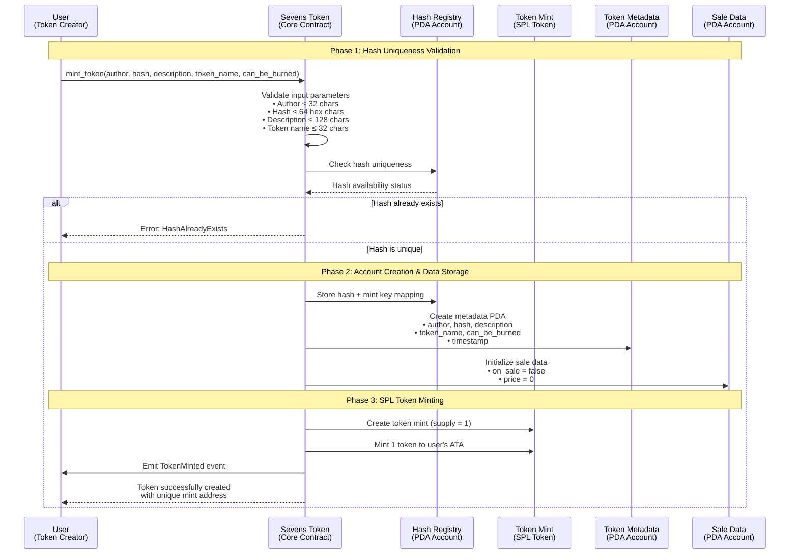
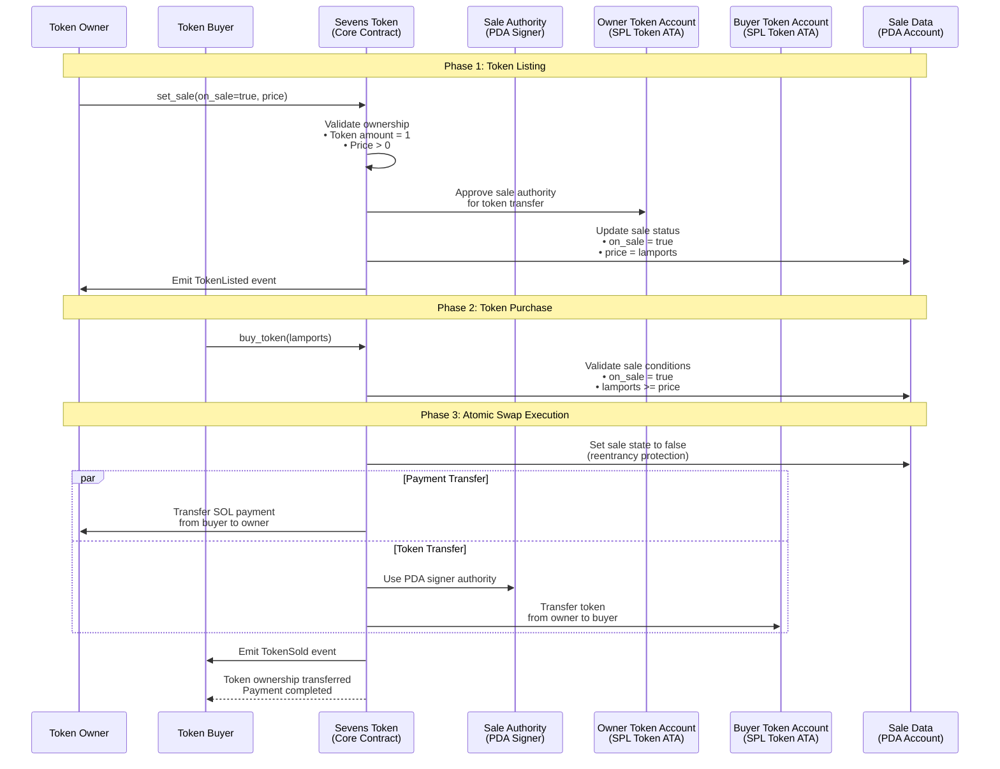
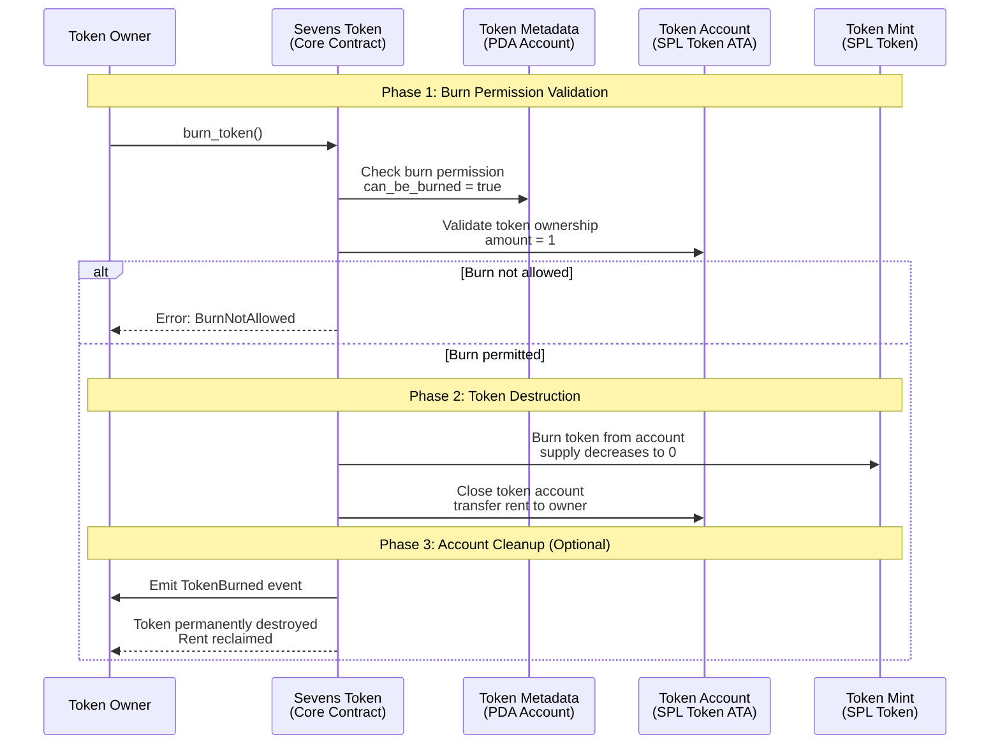
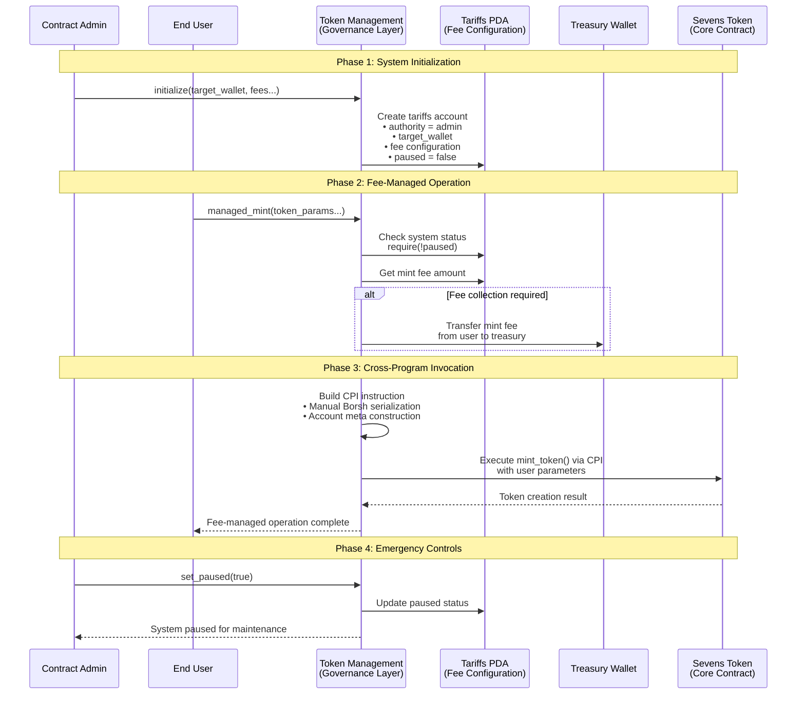
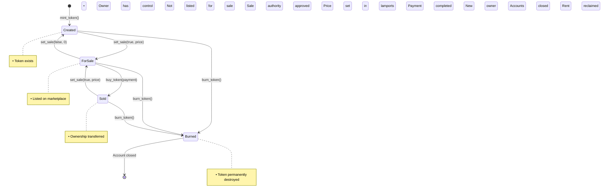

# Sevens Token Smart Contracts

**Enterprise-grade NFT marketplace infrastructure built on Solana blockchain using Anchor framework**

## Overview

A comprehensive dual-contract token ecosystem featuring unique hash-validated NFTs with built-in marketplace functionality and advanced fee management system. Designed for scalability, security, and regulatory compliance.

## System Architecture

### Contract Ecosystem

| Contract | Purpose | Key Innovation |
|----------|---------|----------------|
| **Sevens Token** | Core NFT contract | Hash-based uniqueness validation + native marketplace |
| **Token Management** | Fee & governance layer | Low-level CPI integration + dynamic fee collection |

### Inter-Contract Communication Flow

```
┌─────────────────────────────────────┐
│         Management Layer            │
│  ┌────────────────────────────────┐ │
│  │     Fee Configuration          │ │
│  │  • Mint: Fixed SOL             │ │
│  │  • Sale: Fixed SOL             │ │
│  │  • Buy: Percentage (0-99%)     │ │
│  │  • Burn: Fixed SOL             │ │
│  └────────────────────────────────┘ │
│              │                      │
│              ▼ Low-level CPI        │
│  ┌────────────────────────────────┐ │
│  │   Manual Borsh Serialization   │ │
│  │   + Account Meta Construction  │ │
│  └────────────────────────────────┘ │
└─────────────────┬───────────────────┘
                  │
                  ▼
┌─────────────────────────────────────┐
│           Core Token Layer          │
│                                     │
│  Hash Registry ─────┐               │
│  (Global Unique)    │               │
│                     ▼               │
│  Creator ──▶ [MINT] ──▶ Token Data  │
│                │        (Metadata)  │
│                ▼                    │
│             Treasury                │
│                                     │
│  Owner ────▶ [SALE] ──▶ Sale Data   │
│                │       (Price/Flag) │
│                ▼                    │
│  Buyer ────▶ [BUY] ───▶ Transfer    │
│                │                    │
│                ▼                    │
│             Revenue                 │
└─────────────────────────────────────┘
```

---

## Smart Contract Workflows

### Token Minting Workflow

#### Process Overview
Token minting creates unique NFTs with cryptographic hash validation, ensuring global uniqueness and preventing duplicate content on the blockchain.

#### Detailed Technical Flow



### Token Marketplace Workflow

#### Process Overview
Integrated marketplace functionality allows token owners to list tokens for sale and buyers to purchase them through atomic swap operations.

#### Detailed Technical Flow



### Token Burning Workflow

#### Process Overview
Controlled token destruction allows permanent removal of tokens from circulation with complete account cleanup and rent reclamation.

#### Detailed Technical Flow



### Fee Management Workflow (Management Contract)

#### Process Overview
The management contract provides a governance layer with dynamic fee collection and emergency controls over the token ecosystem.

#### Detailed Technical Flow



### Inter-Contract Communication Architecture

#### Cross-Program Invocation Flow

```
┌─────────────────────────────────────────────────────────────────────────┐
│                        MANAGEMENT CONTRACT LAYER                        │
│  ┌──────────────────────────────────────────────────────────────────┐   │
│  │                    Fee Collection & Validation                   │   │
│  │  • Pre-execution fee collection                                  │   │
│  │  • System status validation (paused check)                       │   │
│  │  • Authority verification                                        │   │
│  │  • Treasury routing                                              │   │
│  └──────────────────────────────┬───────────────────────────────────┘   │
│                                 │                                       │
│                                 ▼  Manual CPI Construction              │
│  ┌─────────────────────────────────────────────────────────────────┐    │
│  │              Low-Level Cross Program Invocation                 │    │
│  │  • Borsh serialization of instruction data                      │    │
│  │  • AccountMeta array construction                               │    │
│  │  • Program ID resolution                                        │    │
│  │  • Instruction discriminator handling                           │    │
│  └──────────────────────────────┬──────────────────────────────────┘    │
└─────────────────────────────────┼───────────────────────────────────────┘
                                  │
                                  ▼
┌─────────────────────────────────────────────────────────────────────────┐
│                      CORE TOKEN CONTRACT LAYER                          │
│  ┌─────────────────────────────────────────────────────────────────┐    │
│  │                     Hash Registry System                        │    │
│  │  • Global uniqueness validation                                 │    │
│  │  • SHA-256 hash to mint key mapping                             │    │
│  │  • Duplicate prevention                                         │    │
│  └──────────────────────────────┬──────────────────────────────────┘    │
│                                 │                                       │
│                                 ▼                                       │
│  ┌──────────────────────────────────────────────────────────────────┐   │
│  │                    Core Token Operations                         │   │
│  │  • SPL Token mint/burn/transfer                                  │   │
│  │  • Metadata storage and management                               │   │
│  │  • Marketplace listing and sales                                 │   │
│  │  • Account lifecycle management                                  │   │
│  └──────────────────────────────────────────────────────────────────┘   │
└─────────────────────────────────────────────────────────────────────────┘
```

### Account Management & PDA Structure

#### Program Derived Addresses (PDA) Architecture

```
┌──────────────────────────────────────────────────────────────────────────────────────────────┐
│                                   PDA ACCOUNT ECOSYSTEM                                      │
└──────────────────────────────────────────────────────────────────────────────────────────────┘

  HASH REGISTRY PDAs                    TOKEN DATA PDAs                      SALE DATA PDAs
  (Global Uniqueness)                 (Per Token Metadata)                (Marketplace State)

┌─────────────────────┐              ┌─────────────────────┐             ┌─────────────────────┐
│  Hash Registry PDA  │              │  Token Metadata PDA │             │   Sale Data PDA     │
│                     │              │                     │             │                     │
│ Seeds:              │              │ Seeds:              │             │ Seeds:              │
│ • "hash_registry"   │              │ • "token_data"      │             │ • "sale_data"       │
│ • content_hash      │──────────────│ • mint_pubkey       │             │ • mint_pubkey       │
│                     │   Reference  │                     │             │                     │
│ Data:               │              │ Data:               │             │ Data:               │
│ • hash: String      │              │ • author: String    │             │ • on_sale: bool     │
│ • mint_key: Pubkey  │              │ • hash: String      │             │ • price: u64        │
│                     │              │ • description: Str  │             │                     │
│ Purpose:            │              │ • token_name: Str   │             │ Purpose:            │
│ Prevent duplicate   │              │ • can_be_burned     │             │ Marketplace state   │
│ content minting     │              │ • timestamp: i64    │             │ & price management  │
└─────────────────────┘              └─────────────────────┘             └─────────────────────┘
                                               │
                                               │ Associated
                                               ▼
                                     ┌─────────────────────┐
                                     │   Sale Authority    │
                                     │       PDA           │
                                     │                     │
                                     │ Seeds:              │
                                     │ • "sale"            │
                                     │ • mint_pubkey       │
                                     │                     │
                                     │ Purpose:            │
                                     │ Authorized signer   │
                                     │ for token transfers │
                                     │ during sales        │
                                     └─────────────────────┘
```

#### Token Lifecycle State Management



---

## Sevens Token Contract

### **Core Concept**
A unique NFT system where each token represents verifiable digital content through cryptographic hash validation. Built with native marketplace functionality and controlled burning mechanisms.

### **Key Features**

**Hash-Based Uniqueness**
- Global registry prevents duplicate content minting
- SHA-256 hash validation with 28-byte seed derivation
- Automatic duplicate detection and rejection

**Integrated Marketplace**
- Native buy/sell without external marketplaces
- SPL Token approval mechanism for secure transfers
- Atomic swap: payment + ownership transfer

**Controlled Burning**
- Creator-defined burn permissions during minting
- Complete account closure with rent reclamation
- Permanent content deletion from blockchain

**Storage Optimization**
- Efficient PDA seeds for deterministic addresses
- Minimal account sizes with precise space allocation
- Rent-exempt account management

---

##  Token Management Contract

### **Core Concept**
An advanced governance and fee collection system that wraps the core token contract with configurable economics and administrative controls. Implements low-level Cross-Program Invocation for seamless integration.

### **Key Features**

**️Dynamic Fee Configuration**
- Runtime fee adjustments by authorized admin
- Mixed fee types: fixed (SOL) + percentage (%)
- Zero-fee operations support for promotional periods

**Emergency Controls**
- System-wide pause/resume functionality
- Admin-only access with signature verification
- Operational state management across all functions

**Automated Revenue Collection**
- Pre-execution fee collection for guaranteed payment
- Direct treasury routing with validation
- Fee calculation and transfer atomicity

**Account Management**
- PDA cleanup functions for rent recovery
- Orphaned account closure capabilities
- Storage optimization and cost reduction

---

## System Integration

### **Contract Interaction Patterns**

#### **Direct Token Operations** (No Fees)
```
User → Sevens Token Contract → Token Operation
```

#### **Managed Operations** (With Fees)
```
User → Management Contract → Fee Collection → CPI → Sevens Token Contract
```

---

## Quick Start

### Prerequisites
```bash
# Development environment
Solana CLI 1.16+     # Blockchain interaction
Anchor 0.29+         # Smart contract framework
Node.js 18+          # Testing and scripts
Rust 1.70+           # Contract compilation
```

### Development Setup
```bash
# Repository setup
git clone https://github.com/anatolii-semochko/sevens-smartcontracts.git
cd sevens-smartcontracts
npm install

# Contract compilation
anchor build

# Test execution
anchor test --skip-deploy

# Local deployment
solana-test-validator &
anchor deploy --provider.cluster localnet
```

### Contract Deployment
```bash
# Program ID validation
make check-program-id

# Network deployment
anchor deploy --provider.cluster devnet

# IDL verification
make validate-idl
```

---

## Complete API Reference

### **Sevens Token Contract**

| Function | Parameters | Description | Access Level |
|----------|------------|-------------|--------------|
| `mint_token()` | `author`, `hash`, `description`, `token_name`, `can_be_burned` | Creates unique NFT with metadata | Public |
| `set_sale()` | `on_sale: bool`, `price: u64` | Lists/unlists token for sale | Token Owner |
| `buy_token()` | `lamports: u64` | Purchases listed token | Public |
| `burn_token()` | None | Permanently destroys token | Token Owner (if allowed) |

### **Token Management Contract**

| Function | Parameters | Description | Access Level |
|----------|------------|-------------|--------------|
| `initialize()` | `target_wallet`, `mint_fee`, `set_sale_fee`, `buy_fee`, `burn_fee` | Initial system setup | Admin Only |
| `update_tariffs()` | `target_wallet`, `mint_fee`, `set_sale_fee`, `buy_fee`, `burn_fee` | Runtime fee updates | Admin Only |
| `set_paused()` | `paused: bool` | Emergency system control | Admin Only |
| `managed_mint()` | `author`, `hash`, `description`, `token_name`, `can_be_burned` | Fee-managed token creation | Public |
| `managed_burn()` | Token mint address | Fee-managed token destruction | Token Owner |
| `close_tariffs()` | None | System cleanup + rent recovery | Admin Only |
| `close_token_data()` | Token mint address | PDA cleanup + rent recovery | Admin Only |

---

## Testing Strategy

### **Test Coverage Matrix**

| Component | Test Type | Coverage |
|-----------|-----------|----------|
| **Token Minting** | Unit + Integration | Hash uniqueness, metadata validation, account creation |
| **Marketplace** | Integration | Sale listing, price setting, atomic purchases |
| **Burning** | Unit | Permission checks, account closure, rent reclaim |
| **Fee Management** | Unit + Integration | Fee calculation, collection, treasury routing |
| **Access Control** | Security | Admin permissions, owner validation, unauthorized access |
| **Error Handling** | Edge Cases | Invalid inputs, state violations, insufficient funds |
| **CPI Integration** | Integration | Cross-contract calls, data serialization, account passing |

### **Running Tests**
```bash
# Full test suite
anchor test

# Contract-specific tests
anchor test tests/sevens-token.ts
anchor test tests/sevens-token-management.ts

# Verbose output with transaction details
anchor test --verbose --skip-deploy
```

---

## Developer Tools

### **Validation Scripts**

**Program ID Consistency Checker**
```bash
./check-program-id.sh
# Validates declare_id! matches keypair files
# Prevents deployment failures
# Comprehensive error reporting
```

**IDL Metadata Validator**
```bash
./validate-idl.sh target/idl/sevens_token.json
# JSON structure validation
# Metadata completeness check
# Address format verification
```

### **Build Automation**
```bash
# Standard operations
make build          # Compile contracts
make test           # Run test suite
make deploy         # Deploy to configured network
make clean          # Clear build artifacts

# Development utilities
make check-program-id  # Validate program consistency
make validate-idl      # Verify IDL structure
make lint              # Code style checking
```

---

## Production Considerations

### **Performance Characteristics**
- **Transaction Throughput**: Optimized for high-frequency trading
- **Storage Efficiency**: Minimal on-chain footprint per token
- **Compute Optimization**: Efficient instruction execution
- **Rent Economics**: Automated rent reclamation on account closure

### **Security Architecture**
- **Static Analysis**: Anchor security constraints
- **Access Control**: Multi-layered permission system
- **Economic Security**: Fee validation and overflow protection
- **Audit Trail**: Comprehensive event emission for external monitoring

### **Scalability Features**
- **Batch Operations**: Support for bulk token operations
- **PDA Optimization**: Deterministic address generation
- **Cross-Program Efficiency**: Minimal CPI overhead
- **State Management**: Efficient account size calculation

### **Operational Management**
- **Upgradeable Architecture**: Contract migration support
- **Emergency Controls**: System-wide pause capabilities
- **Fee Flexibility**: Runtime economic parameter adjustment
- **Monitoring Integration**: Event-based observability

---

## Live Token Examples

The following screenshots demonstrate deployed Sevens Tokens on the Solana blockchain, showcasing the real-world implementation of the smart contract system:

### Token Overview on Solana Explorer

*Aquarium token (SEV) displayed in Solana Explorer showing NFT metadata, verification status, and transaction history. Demonstrates the integrated marketplace functionality with 0% seller fee and direct blockchain validation.*

### Token Metadata Structure

*Detailed Metaplex metadata JSON showing the token's complete on-chain structure including authority configurations, update permissions, and immutable properties. Highlights the sophisticated metadata management capabilities of the Sevens Token system.*

### Transaction History

*Test Opera token transaction timeline demonstrating successful minting, transfer operations, and blockchain interactions over time. Shows the contract's operational stability and transaction processing capabilities.*

### Demonstration Token - Permanent Sevens Token

**[View on Solana Explorer](https://explorer.solana.com/address/5tZjU48ZNzue6N6kMmuhh8bo1QSHYSF159aQ9s18sg3Y?cluster=devnet)**

- **Token Address**: `5tZjU48ZNzue6N6kMmuhh8bo1QSHYSF159aQ9s18sg3Y`
- **Author**: Anatolii Semochko
- **Created**: May 25, 2026
- **Hash**: `c628dead6e58335abb80f792b1510562e76ca0fc8e731771c711166a0c1eac72`
- **Description**: Demo token for Sevens Platform - showcases digital material tokenization, validation, and blockchain-based ownership proof.

This permanent demonstration token exemplifies the complete smart contract functionality, serving as a reference implementation for digital material tokenization with verified metadata integrity and full marketplace compatibility.

---

## Sevens Ecosystem

The Sevens platform consists of four interconnected projects that work together to provide a complete blockchain tokenization solution:

### **[Sevens Backoffice](https://github.com/anatolii-semochko/sevens-backoffice)**
*Administrative control center and revenue management platform*
- **Technology**: PHP/Symfony, React/Redux, MySQL, Docker
- **Purpose**: Administrative dashboard for token operations monitoring, fee configuration, user management, and financial analytics
- **Key Features**: Real-time transaction monitoring, emergency system controls, tariff management, comprehensive reporting

### **[Sevens Platform](https://github.com/anatolii-semochko/sevens-platform)**
*Main user-facing application for digital material tokenization and trading*
- **Technology**: PHP/Symfony, React/TypeScript, MySQL, AWS S3, Docker
- **Purpose**: Complete web platform for creating, managing, and trading blockchain tokens representing digital materials
- **Key Features**: Token creation & management, marketplace functionality, wallet integration, file storage & CDN

### **[Sevens Smart Contracts](https://github.com/anatolii-semochko/sevens-smartcontracts)**
*Enterprise-grade NFT marketplace infrastructure built on Solana*
- **Technology**: Rust, Anchor Framework, Solana blockchain
- **Purpose**: Dual-contract token ecosystem with hash-validated NFTs and built-in marketplace functionality
- **Key Features**: Hash-based uniqueness validation, dynamic fee collection, inter-contract communication, governance layer

### **[Sevens Wallet React](https://github.com/anatolii-semochko/custom-solana-wallet-react)**
*Custom Solana wallet interface library with extended functionality*
- **Technology**: React, TypeScript, Solana Web3.js, CryptoJS
- **Purpose**: Comprehensive React library for building custom wallet interfaces compatible with Phantom API
- **Key Features**: Multi-language support, encrypted storage, transaction validation, modular architecture

### Architecture Overview

```
┌──────────────────────────────────────────────────────────────────┐
│                        SEVENS ECOSYSTEM                          │
│                                                                  │
│  ┌─────────────────┐    ┌─────────────────┐    ┌──────────────┐  │
│  │   BACKOFFICE    │    │    PLATFORM     │    │   WALLET     │  │
│  │   (Admin)       │◄──►│  (User App)     │◄──►│  (Library)   │  │
│  │ • Fee Config    │    │ • Token Trading │    │ • UI Comps   │  │
│  │ • Monitoring    │    │ • Marketplace   │    │ • Security   │  │
│  │ • Analytics     │    │ • File Storage  │    │ • Multi-lang │  │
│  └─────────────────┘    └─────────────────┘    └──────────────┘  │
│           │                      │                     │         │
│           │                      │                     │         │
│           └──────────────────────┼─────────────────────┘         │
│                                  │                               │
│                  ┌───────────────▼───────────────┐               │
│                  │        SMART CONTRACTS        │               │
│                  │         (Blockchain)          │               │
│                  │     • Token Operations        │               │
│                  │     • Marketplace Logic       │               │
│                  │     • Fee Collection          │               │
│                  │     • Hash Validation         │               │
│                  └───────────────────────────────┘               │
└──────────────────────────────────────────────────────────────────┘
```

This integrated ecosystem provides a complete solution for blockchain-based digital asset tokenization, from smart contract infrastructure to user interfaces and administrative tools.

---

## License & Contact

**License**: MIT License - see [LICENSE](LICENSE) file for details.

**Technical Contact**: [Anatolii Semochko](https://github.com/anatolii-semochko)
**Professional Profile**: [LinkedIn](https://linkedin.com/in/anatolii-semochko)

---

**Built with**: Rust, Anchor Framework, Solana Blockchain
**Architecture**: Dual-contract ecosystem with advanced CPI integration
**Security**: Enterprise-grade validation and access control